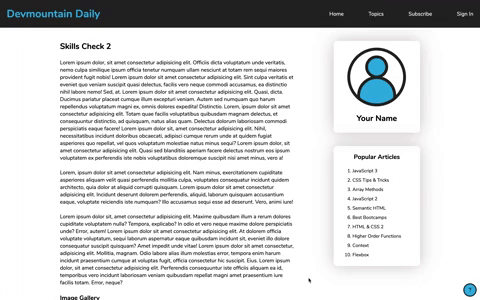
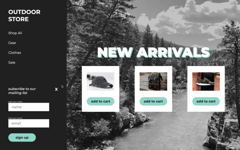

# Devmountain Web - Skills Check 2

## Project Summary
Welcome to skills check 2! This skills check will be similar to Skills Check 1. There are 4 sections covering JavaScript, HTML, and CSS concepts. Remember to use past code, lecture notes & slides, and reference websites to help you as you complete this skills check.

For full time students, you should be able to finish this skills check in an 8 hour day. 

For part time students this means it should take two days. On the first day, you should aim to complete the [html-css](#HTML-CSS) folder and [javascript-1](##JavaScript-1). On the second day, you should aim to complete [javascript-2](##JavaScript-2) and [vanilla-js](#Vanilla-JS) sections.

This skills check will cover topics from these lectures:

- [JavaScript 3](https://github.com/DevMountain/web-curriculum-v3/tree/master/05-javascript-3)
- [HTML/CSS 2](https://github.com/DevMountain/web-curriculum-v3/tree/master/06-html-css-2)
- [JavaScript 4](https://github.com/DevMountain/web-curriculum-v3/tree/master/07-javascript-4)
- [JavaScript 5](https://github.com/DevMountain/web-curriculum-v3/tree/master/08-javascript-5)

## Setup

- `Fork` this repository.
- `Clone` down to your computer.
- Start coding!

# HTML-CSS

## Summary
It's time to re-create another page using your HTML and CSS skills. Watch the gif below to see an overview of the entire page. There is also a mockup screenshot in the assets folder that shows off the entire page. You'll also see the `example.png` screenshot in that folder. This shows what the page should look like from a typical screen size. Notice that the header and question bubble in the bottom right are staying in their original places.

## Instructions

- open up the `mockup.png` file in the html-css folder to see what your end goal is
- open the `index.html` file in your browser to be able to see the changes (you can use live-server or just copy/paste the path into your browser)
- work in the `index.html` and `styles.css` files to re-create the mockup as closely as you can
- the `.svg` files are images that you can use if you would like

### Make sure that you use *at least* the following elements and styles:

| HTML | CSS |
| --- | --- |
| header | position (relative, sticky, etc.) |
| nav | display |
| section | flex (justify-content, wrap, etc.) |
| article | font-family |
| h1, h2, etc.| padding |
| aside | color |
| main | relative units (%, vw, vh) |
| br | margin |
| body | box-shadow |
| img | font-size |
| ol |  |
| li |  |
| footer |  |
| title |  |
| meta (description) |  |

# JavaScript Problems

## Instructions

The JavaScript sections will each consist of following the same series of instructions, but with different JavaScript files and spec runnner files for each folder.

## JavaScript-1

- Open `javascript-1.js` with your code editor.
- Open `SpecRunner-1.html` with your browser.
- Complete the problems in `javascript-1.js` and check your progress using the spec runner
- Remember that you can use the Chrome Dev Tools (inspect)

## JavaScript-2

- Open `javascript-2.js` with your code editor.
- Open `SpecRunner-2.html` with your browser.
- Complete the problems in `javascript-2.js` and check your progress using the spec runner
- Remember that you can use the Chrome Dev Tools (inspect)

# Vanilla-JS

## Summary

For this section of the skills check, you'll be using JavaScript to add in functionality to an existing project. You'll be starting with all the HTML and CSS, but no JavaScript. The website is a landing page for an online store and when you're done, users should be able to enter their name and email address into a form and add items into a cart. Since you're just starting out and there is no back end, the functionality will be a little modified for what you can do now.

## Instructions

In the `vanilla-js` folder, there is an `index.html` file which will show you the actual website when opened in the browser. You'll be working in that html file as well as the `index.js` file. If you're stuck, you can open up the console (inspect) in the browser and check for errors there.

### Step 1 - Hide and Show Subscribe Form

In this step, you will write a function that will hide the subscribe form when the 'X' is clicked. When the form is hidden, the 'X' should be a '+'. And then when the '+' is clicked, the form should reappear.

#### index.js

- use `getElementById` to select the `h3` element with an id of `close-form` and save it to a variable called `formBtn`
- use `querySelector` to select the `form` using the tag name `form` and save it to a variable called `form`
- write a function called `toggler` which should:
    - use the built-in `toggle` function on `form`'s `classList` to toggle a class called `hide`
    - go into the `styles.css` file to see what the `hide` class does
    - write a conditional (you can use an if-then or a ternary) that checks if `formBtn`'s `innerText` is strictly equal to 'X'
    - if it does equal 'X', change the `innerText` to be a '+' instead
    - if it does not equal 'X', change the `innerText` to be an 'X'
- with those two variables and our function written, the `toggler` function should hide the form and change the 'X' back and forth to a '+', now you just need to connect it to your HTML

#### index.html

- add a `script` tag at the bottom of your `body` node and connect to `index.js`
- assign the `toggler` function to the `h3` element on line 25 in an `onclick` event attribute 

### Step 2 - Form Validation

Now you are going to write a function to make sure that users type something in the form inputs before submitting. If they don't, they will be alerted to the problem and the missing field(s) will be highlighted.

#### index.js

- use `getElementsByTagName` to select the name and email inputs 
- save the name input to a variable called `nameInput`
- save the email input to a variable called `emailInput`
    - hint: remember that you can access these elements by index like in an array
- create a variable called `emailList` and set it to an empty array
    - you are going to store the subscriber information here -- this is one of those cases where you will do something that you know how to do in place of more complicated things
- write a function called `validateForm` that will house a large if-else statement. everything in this function will be inside the if-else.
    - the first condition should check if both the `nameInput.value` and `emailInput.value` are false, which would mean that they are empty
        - if they are, change both input fields' borders to be a solid red line with a 2px width using the `style` object
        - you should also set an `alert` that tells the user 'you must enter a name and an email address to subscribe!'
    - next use an `else if` to check if just the `nameInput.value` is false
        - if it is, change the name input's border to be a solid red line with a 2px width using the `style` object
        - also set an `alert` that says 'please enter a name to subscribe'
    - next use another `else if` to check if just the `emailInput.value` is false
        - if it is, change the email input's border to be a solid red line with a 2px width using the `style` object
        - also set an `alert` that says 'please enter an email address to subscribe'
    - finally, in the last `else`, you will write the functioanlity that should be carried out if the form has both a name and an email entered
        - push an object with `name` and `email` properties, whose values come from the `nameInput` and `emailInput` values respectively, into the `emailList` array
        - in the next step, you are going to call another function inside the `else` block as well
    - now that you have the `validateForm` function written, you need to connect it to your HTML using `addEventListener`
        - below your `validateForm` function, call `addEventListener` on your `form` variable, passing in the string 'submit' and a callback function
            - the callback function should have one parameter named `event`
            - inside the callback, invoke `event.preventDefault`
            - then invoke `validateForm`

### Step 3 - Thank You Message

Next, you will write the functionality to change the form into a thank you message 
and then delete the thank you message after 3 seconds.

#### index.js

- use `getElementsByClassName` to select the div that holds the form by its class name `form-container`
- save the container to a variable called `formContainer`
- write a function called `removeMessage` that you will call inside your next function to remove the `formContainer`
    - use the `.remove` method on `formContainer` to delete it from the DOM
- write a function called `displayThankYou` which should: 
    - change the `innerText` of `formContainer` to the string: 'Thank you for subscribing!'
    - call the built in JavaScript function `setTimeout`, which takes in two parameters, a callback and a time
        - send in `removeMessage` as the callback
        - send in 3000 for the time (in milliseconds)
        - for example: `setTimeout(someFn, 5000)`
- back in the else block of `validateForm`, invoke the `displayThankYou` function after you push the email information into the `emailList`

### Step 4 - Removing Red Border

You already set up a function to change the email and name inputs' borders to be red if they are left blank. Now, you are going to get rid of the red border if the user types something into that field. You already have `emailInput` and `nameInput` variables that are selecting those inputs from the HTML for you, let's add event listeners to those.

#### index.js

- call `addEventListener` on `nameInput`, passing in the string 'change' and a callback function
    - the callback should change `nameInput`'s border to 'none' using the style object
- call `addEventListener` on `emailInput`, passing in the string 'change' and a callback function
    - the callback should change `emailInput`'s border to 'none' using the style object

### Step 5 - Cart Items Counter

Last, you'll make a 'cart' to track added items. Since you won't be saving this information to a server or database yet, you'll just create a cart counter that will increment as the 'add to cart' buttons are clicked. You will be adding a new HTML element that will show up in the top right of our page.

#### index.js

- use `createElement` to create a new `div` element, call the div `cart`
- using `querySelector`, select the `main` node from your html file and save it to a variable called `main`, this is the node that you will append our new cart node to
- create a variable called `cartItems` and set it to 0, this is the variable that will keep track of how many items are in the cart
- now let's make the function that will fire when the 'add to cart' buttons are clicked
    - name the function `addToCart`
    - `addToCart` should contain an if-else statement
    - if `cartItems` equals 0 when one of the buttons is clicked, then a few things need to happen
        - set `cartItems` to equal 1
        - use `setAttribute` to add a `class` called `cart-display` to your `cart` div
        - set the `innerText` of the `cart` div to be 'Your Cart: 1 item'
        - use `appendChild` to add the `cart` div onto `main`
    - else, when the `cartItems` does not equal 0, two things need to happen
        - add 1 to `cartItems`
        - set the `innerText` of the `cart` div to be 'Your Cart: `cartItems` items', which should then show the correct number from `cartItems` in the `cart` div

#### index.html

- add an `onclick` attribute to all 3 'add to cart' buttons that invokes the `addToCart` function

### You're done!

Congratulations on finishing your second skills check! 